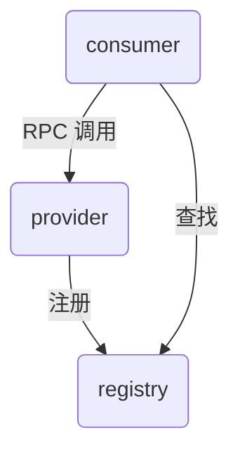

# AK-RPC framework

## 1 介绍
AK-RPC 是一个高性能、可扩展的远程过程调用（RPC）框架，旨在简化分布式系统中的服务间通信。它支持多种传输协议和序列化格式，提供了丰富的功能特性，如负载均衡、服务发现和故障恢复。

## 2 特性（开发中）
- 高性能：采用高效的网络传输和序列化机制，确保低延迟和高吞吐量。
- 可扩展性：模块化设计，方便用户根据需求扩展功能。
- 服务发现：内置服务注册与发现机制，支持多种服务发现方案。
- 负载均衡：支持多种负载均衡算法，提升系统的可靠性和性能。
- 易用性：提供简洁的 API 和丰富的文档，降低使用门槛。

## 3 架构
AK-RPC 框架主要由以下几个核心组件组成：
- 注册中心（registry）：用于服务注册与发现，维护服务实例的信息。
- 服务器端（provider）：接收客户端请求，执行相应的服务逻辑，并返回结果。
- 客户端（consumer）：负责发起远程调用请求，处理响应结果。

组件关系图：

## 4 快速开始
先启动 provider app，再启动 consumer app。示例服务：`com.shift.akrpc.common.example.CalcService`。
